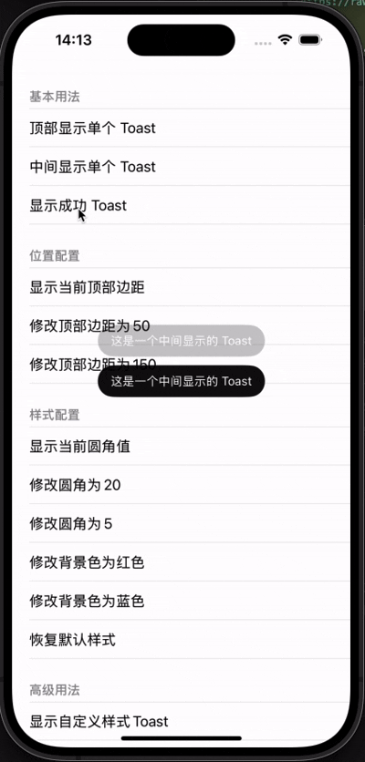

# AMToast

[English](README.md) | [简体中文](README_CN.md)

一个简单且可自定义的 iOS Toast 提示库。



## 特性

- 支持多个显示位置（顶部和中间）
- 基于队列的多 Toast 显示
- 可自定义样式（圆角、背景颜色）
- 支持深色模式
- 可自定义字体大小和样式
- 支持自定义视图
- 支持屏幕旋转适配

## 系统要求

- iOS 13.0+
- Swift 5.0+

## 安装

### Swift Package Manager

在您的 `Package.swift` 文件中添加以下依赖：

```swift
dependencies: [
    .package(url: "https://github.com/owlivendy/AMToast.git", from: "0.3.0")
]
```

或者在 Xcode 中：
1. 进入 File > Swift Packages > Add Package Dependency
2. 输入仓库地址：`https://github.com/owlivendy/AMToast.git`
3. 选择您想要使用的版本

### CocoaPods

```ruby
pod 'AMToast'
```

## 使用方法

### 基础用法

```swift
// 显示一个简单的 toast
AMToast.show(with: "这是一条提示消息")

// 在顶部显示 toast
AMToast.show(with: "这是一条顶部提示", position: .top)

// 显示成功提示
AMToast.showSuccess(with: "操作成功！")
```

### 自定义样式

```swift
// 自定义圆角
AMToastConfig.ToastViewStyle.cornerRadius = 20

// 自定义浅色模式背景色
AMToastConfig.ToastViewStyle.BackgroundColor.light = UIColor.red.withAlphaComponent(0.94)

// 自定义深色模式背景色
AMToastConfig.ToastViewStyle.BackgroundColor.dark = UIColor(white: 0.2, alpha: 0.94)

// 自定义浅色模式文字颜色
AMToastConfig.ToastViewStyle.TextColor.light = UIColor.white

// 自定义深色模式文字颜色
AMToastConfig.ToastViewStyle.TextColor.dark = UIColor.white

// 自定义浅色模式字体大小
AMToastConfig.ToastViewStyle.Font.light = UIFont.systemFont(ofSize: 16)

// 自定义深色模式字体大小
AMToastConfig.ToastViewStyle.Font.dark = UIFont.systemFont(ofSize: 16)

// 使用粗体字体
AMToastConfig.ToastViewStyle.Font.light = UIFont.boldSystemFont(ofSize: 14)
AMToastConfig.ToastViewStyle.Font.dark = UIFont.boldSystemFont(ofSize: 14)

// 自定义位置边距
AMToastConfig.Position.topMarginPortrait = 100
AMToastConfig.Position.topMarginLandscape = 20

// 重置所有配置为默认值
AMToastConfig.resetToDefault()
```

### 自定义视图

```swift
// 创建自定义视图
let customView = UIView()
// 添加您的自定义 UI 元素...

// 创建 toast 视图
let toastView = AMToastView()
toastView.contentInsets = UIEdgeInsets(top: 12, left: 20, bottom: 12, right: 20)
toastView.customView = customView

// 显示自定义 toast
AMToast.show(with: toastView, position: .center)
```

## 许可证

AMToast 使用 MIT 许可证。详情请查看 LICENSE 文件。 